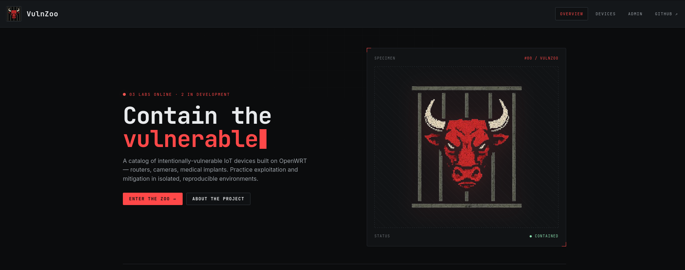
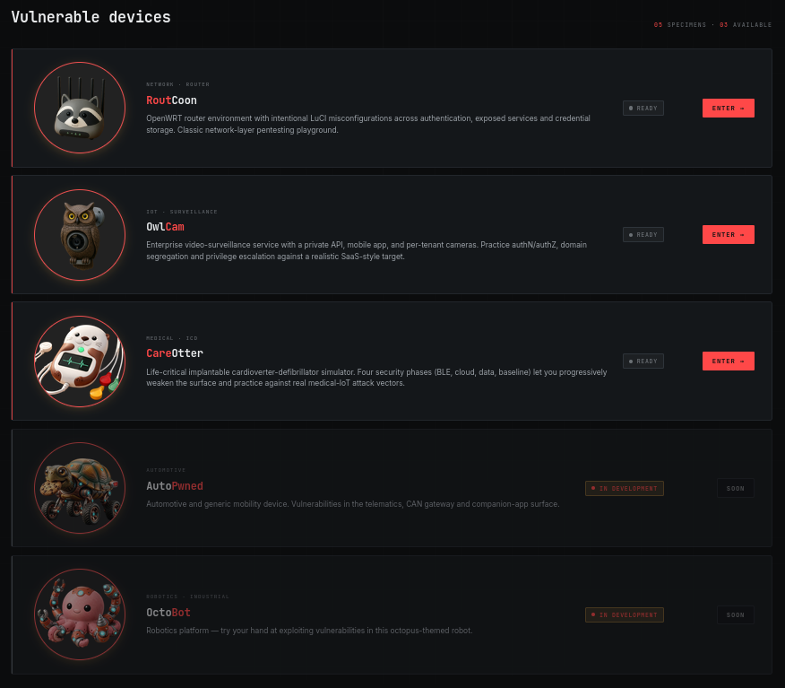
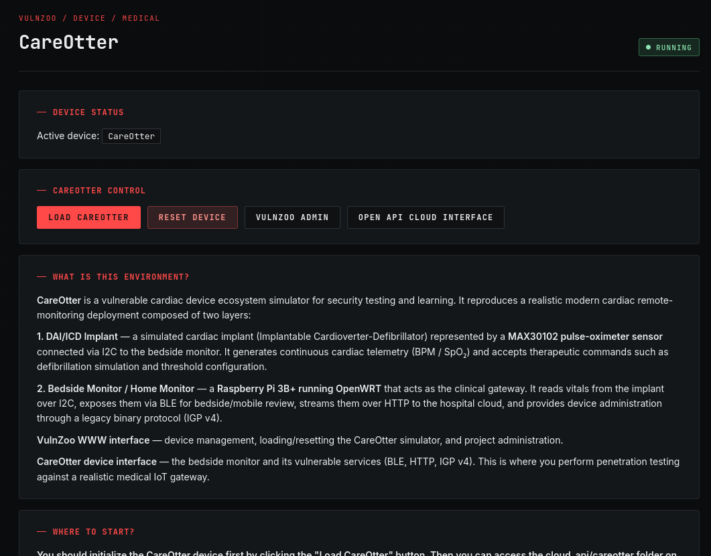
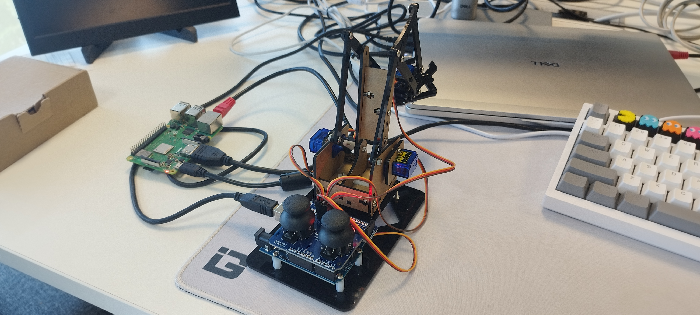
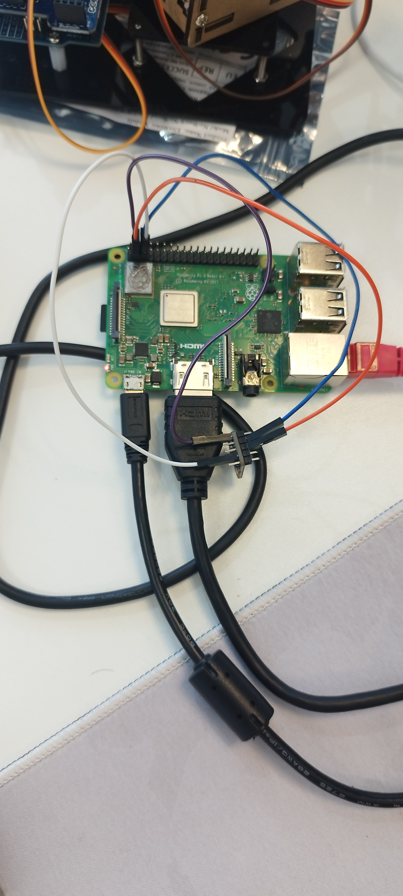
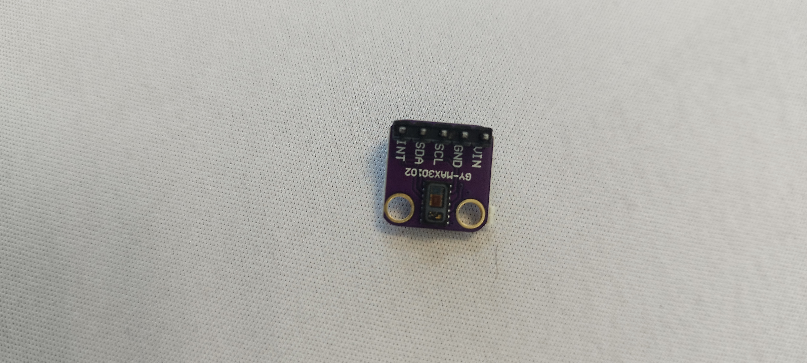
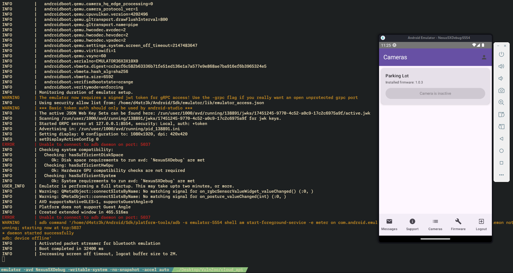
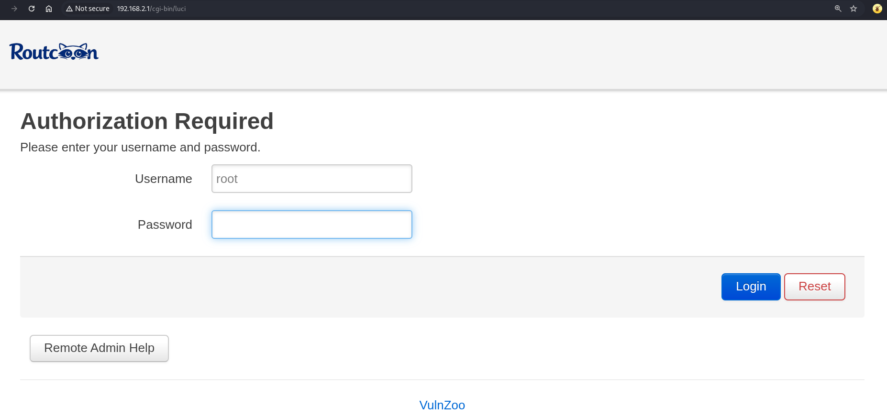
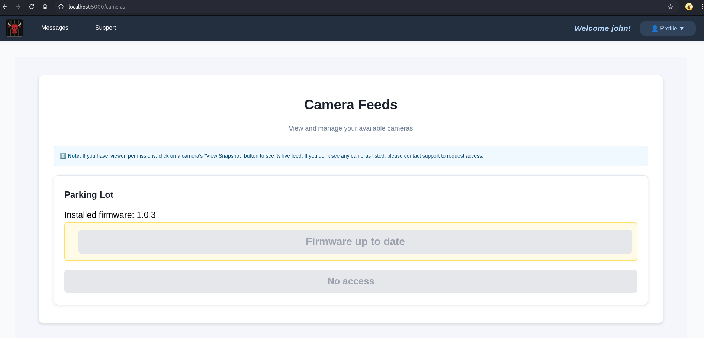
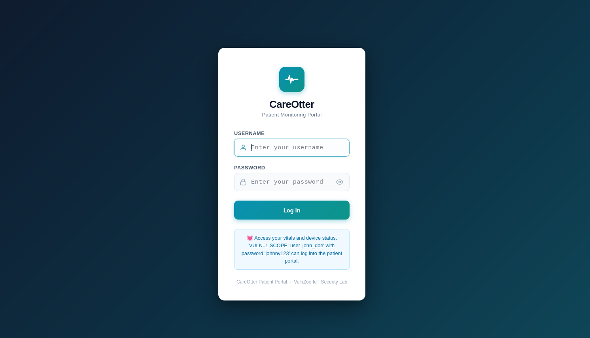

# VulnZoo: Integrated Environment for Product Cybersecurity Evaluation

## Executive Summary

The growing digitization of embedded devices and IoT in critical sectors such as healthcare, industrial, automotive, and telecommunications has exponentially expanded the attack surface in global cybersecurity. Although training initiatives address web, mobile, and certain IoT security topics, they are generally isolated and not designed to simulate realistic, end-to-end product ecosystems spanning medical, industrial and automotive domains.

VulnZoo is an open-source ecosystem of vulnerable devices designed to fill the gap in practical cybersecurity training in embedded, medical, industrial and automotive environments. Unlike current platforms that focus on isolated components, VulnZoo models a complete IoT product from device firmware to mobile applications and cloud services allowing the study of realistic attack chains between multiple components.

The project was created in response to the growing demand for professionals trained in connected device security and the increasing regulatory and standardization pressure worldwide. This includes regulations such as the EU Cyber Resilience Act (CRA), the NIS2 Directive, RED DA and the US Cyber Trust Mark, as well as internationally recognized standards and frameworks such as IEC 62443, ISO/SAE 21434, and ETSI EN 303 645, all of which require structured security evaluation before products can be commercialized or deployed.

## The Training Gap

Massive digitization has turned home routers, IP cameras, industrial control systems (PLCs), medical devices and automotive ECUs into prime targets for cyberattacks. However, the cybersecurity industry faces a paradox: it lacks realistic training environments that simulate the complexity of these systems.

Existing training platforms have critical limitations:

- **Limited scope**: They focus on exposing a single layer with vulnerabilities, ignoring the fact that real attacks exploit different layers due to the trust relationships between components.

- **Lack of realism**: They do not model OTA update scenarios, cloud APIs or companion applications that are standard in modern IoT products.

- **Absence of critical components**: No open-source platform simultaneously integrates medical, industrial, and automotive devices with their respective regulations.

- **Impossibility of regulatory validation**: There are no reproducible environments to verify compliance with certification schemes in real evaluations.

This gap leaves professionals, researchers, and manufacturers without the right tools to develop essential skills in a market where security is a key factor and a legal requirement.

## A Complete Environment on a Raspberry Pi

VulnZoo transforms a Raspberry Pi into a complete cybersecurity laboratory, integrating multiple technological domains into a single cohesive platform.

### Multi-Component Architecture

The ecosystem models a real product with all its interconnected layers:

- **RoutCoon**: Home router with typical vulnerabilities (default credentials, exposed unencrypted services, insufficient validation in remote configuration).

- **OwlCam**: IP camera system with unencrypted streams, weak authentication, and insecure APIs.

- **CareOtter** (in development): Connected medical device with insecure storage of sensitive data and unencrypted communications.

- **AutoPwned** (in development): Automotive ECU simulation with vulnerabilities in SOME IP or CAN-like protocols.

- **OctoBot** (in development): Robotic arm simulation that uses industrial communication protocols like Modbus TCP/IP.

### Mobile Applications

- Android/iOS companion apps that interact with devices, incorporating hardcoded secrets, incorrect certificate validation, and broken authorization logic—serving as entry points to the backend.

### REST API

- Containerized REST APIs in Docker that manage business logic, OTA distribution, and administrative panels, with intentional access control failures, stateful privilege escalation, and data exposure between tenants.

This architecture allows complex attack chains to be carried out: from a vulnerability in the mobile app, pivoting to cloud APIs, escalating privileges to compromise the OTA service, and finally implanting malicious firmware on the physical device.

## Ease of Use

The project prioritizes accessibility without sacrificing technical depth:

### Simplified Deployment

The system operates on OpenWRT v24.10.2 and AGL (Automotive Grade Linux is used in the automotive laboratory), ensuring compatibility with modern hardware. Users can choose between a precompiled image ready for use (flashable directly to SD) or compile their own custom image from the source code available on GitHub.

### Intuitive Web Interface

Once the Raspberry Pi is started, the user accesses a web management panel via a browser where they select the desired lab. The system automatically activates the corresponding services, configuring the vulnerable environment without the need for complex manual intervention.

### Integration with External Services

For scenarios that require cloud APIs, VulnZoo uses Docker containers that the user starts with a single command (`docker-compose up`), simulating external servers in an isolated and realistic way. The connection is simply established via Ethernet cable between the user's PC and the Raspberry Pi, without complex network configurations.

### Vulnerable/Secure Comparison

Each lab includes the option to apply secure configurations, allowing the user to directly compare the behavior of the system before and after mitigation, reinforcing the learning of best practices and facilitating the security evaluations against relevant standards and regulations.

## Impact and Vision

VulnZoo is designed to serve multiple communities:

- **Training**: It provides students and professionals with a realistic environment in which to develop skills in IoT exploitation, firmware analysis, and penetration testing in complete ecosystems.

- **Research**: It offers structured fuzzing targets for the development of automated analysis tools and AI-assisted vulnerability discovery.

- **Industry**: Allows embedded device manufacturers to validate their secure development processes against regulations such as the European CRA before investing in formal certification.

- **Regulation**: Establishes a transparent feedback mechanism where independent laboratories publish open evaluation reports, identifying ambiguities in regulatory requirements and promoting continuous improvement of certification schemes.

The ultimate goal of the project is to donate it to OWASP, ensuring neutral governance, global adoption, and community-led evolution. VulnZoo is not just a vulnerability lab: it is the first open-source infrastructure specifically designed to bridge offensive research with regulatory validation in the IoT space.

## Project Images

Once VulnZoo's image is flashed and running on the Raspberry Pi, a HTTP service will be running on http://192.168.2.1:8080. There is information about the project and laboratories.

### VulnZoo interface

### VulnZoo devices list

The laboratories can be launched using "LOAD <DEVICE>" buttons. The interfaces that are part of each laboratory are available via "<DEVICE> INTERFACE" buttons.

### VulnZoo running device / Administration panel

All labs can be completed without the use of additional hardware devices, but they can be used to enrich the experience. Devices used in testing and proven to be compatible with the system will be noted in the documentation.

One of the objectives of the platform was to rely on widely available and low-cost hardware components that can be easily obtained and integrated. Examples of the components used include:

- Heart Rate Sensor (MAX30102) – approx. $2
- Mechanical Robot Arm (SG90 / MG90S) – approx. $15
- CAN Bus Module (MCP2515) – approx. $2
- USB Camera – any standard USB camera can be used

### OctoBot Laboratory hardware used (SG90 MG90S Mechanic robot)

### CareOtter laboratory hardware used (MAX30102 heart rate sensor)

### Android apps included on laboratories environment

### RoutCoon: vulnerable router administration interface

### OwlCam: Camera's API

### CareOtter: ICDs API

