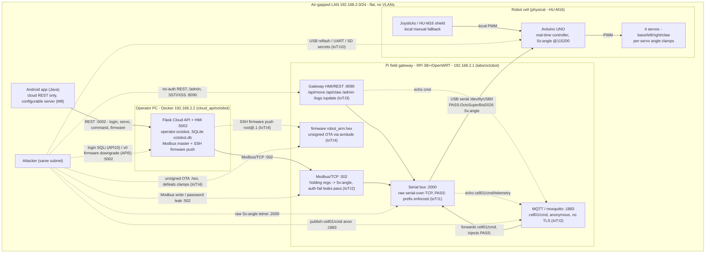

# OctoBot - Industrial Robotic Arm Lab

> **Layer 3 device landing page.** Status: implemented (MWP stages 01-04 complete), verified in simulation, pending an on-Pi lab-load verification. The vulnerabilities are intentional.

OctoBot is the VulnZoo industrial/ICS lab. A 4-DOF robot arm (HU-M16 shield on an Arduino UNO) is driven in real time by the Arduino, while a Raspberry Pi running OpenWRT sits on top as the network field gateway between the arm and the cloud API / mobile app. The Pi carries the entire OWASP IoT attack surface (a raw serial bus, MQTT, Modbus/TCP, an HMI/REST panel, and an unsigned OTA path), and the arm provides the physical impact that makes each finding tangible.

## Quick facts

|                      |                                                                                |
| -------------------- | ------------------------------------------------------------------------------ |
| Domain               | Industrial control system (robotic arm)                                        |
| Platform             | OpenWRT v24.10.3 on Raspberry Pi 3B+                                           |
| Real-time controller | Arduino UNO + HU-M16 shield, 4 servos (SG90/MG90S)                             |
| Pi <-> Arduino link  | USB serial 115200, `Sx:angle` frames                                           |
| Industrial protocol  | Modbus/TCP (`:502`) PC master -> Pi gateway                                    |
| Cloud                | Dockerized Flask REST + web UI (`:5002`), single-operator login (SQLite)       |
| Mobile               | Android control app (Java, cloud REST) under `../../vulnzoo_apps/octobot_app/` |
| Network              | `192.168.2.0/24`, Pi at `192.168.2.1`, direct Ethernet                         |

## Help / inspection account

The lab ships a low-privilege **help user** named `easyuser` so students can still log in and inspect the system even when the `root` account has been hardened. This account is created by the `11-add-users.sh` profile hook and is **out of scope as an attack target** — it exists only for exploration and to support the firmware-analysis walkthrough.

| Account | Password | Purpose |
| ------- | -------- | ------- |
| `root` | `dococtopus` | Administrative account (intended to be secured by the attacker/defender exercise). |
| `easyuser` | *(none set; login not possible with password)* | Inspection-only account for students who want to follow the system/firmware steps without breaking the `root` challenge. |

A README at `/home/easyuser/README.txt` reminds the student that this account is not part of the lab objectives and points to [`Vulns/IoT/IoT_Firmware_Static_Analysis.md`](Vulns/IoT/IoT_Firmware_Static_Analysis.md) for the static-analysis procedure.

## Documents

- [`OPENWRT_INTEGRATION.md`](OPENWRT_INTEGRATION.md) - build plan and MWP stages roadmap (single source of truth for architecture, protocol, register map, OWASP catalog).
- [`../../labs/octobot/arduino_stuff/bot-overview.md`](../../labs/octobot/arduino_stuff/bot-overview.md) - HU-M16 firmware, drivers, and controller analysis.
- [`Vulns/README.md`](Vulns/README.md) - vulnerability index (OWASP IoT Top 10).
- [`../../labs/octobot/CONTEXT.md`](../../labs/octobot/CONTEXT.md) - Layer 2 lab contract.
- Build guide: merged into [`OPENWRT_INTEGRATION.md`](OPENWRT_INTEGRATION.md); there is no separate `Build_Guide.md`.

## Vulnerability surface

The lab implements the OWASP IoT Top 10 (`IoT:I1`..`IoT:I10`), each behind a `VULNERABLE`/`SECURE` config toggle. See [`Vulns/README.md`](Vulns/README.md) for the catalog and status.

## Launch and verify

Defaults: Pi `192.168.2.1` over direct Ethernet, gateway `:8090`, serial bus `:2000`, Modbus `:502`, MQTT `:1883`, cloud `:5002`. Full reference: [`OPENWRT_INTEGRATION.md`](OPENWRT_INTEGRATION.md) Sections 2-6.

### 1. (Hardware only) build and ship the firmware

The sketch is already patched. Compile it on a PC and place the `.hex` in the overlay, then repackage. Skip for simulation, where the serial bus fakes the arm.

```sh
arduino-cli core install arduino:avr
arduino-cli compile --fqbn arduino:avr:uno --output-dir /tmp/octobot-fw \
  "src/labs/octobot/arduino_stuff/Youfang Smart-ARM-code-v1.71-joystick"
cp /tmp/octobot-fw/*.ino.hex src/labs/octobot/files/opt/octobot/firmware/robot_arm.hex
cd src/labs/octobot/files && tar -czf octobot.tar.gz opt etc usr
mv octobot.tar.gz ../../vulnzoo/files/usr/lib/vulnzoo-devices/octobot.tar.gz
```

### 2. Deploy on the Pi

Load via the Device Manager UI (`http://192.168.2.1:8080`, select `octobot`), or manually over SSH:

```sh
scp src/labs/vulnzoo/files/usr/lib/vulnzoo-devices/octobot.tar.gz root@192.168.2.1:/usr/lib/vulnzoo-devices/
ssh root@192.168.2.1
tar -xzf /usr/lib/vulnzoo-devices/octobot.tar.gz -C /
for h in /usr/lib/vulnzoo-hooks/profile-init.d/*-octobot-*.sh; do sh "$h"; done
```

Hooks run in order: `05` detect tty and set `use_real_hardware`, `15` install deps, `40` conditional firmware flash, `50` start mosquitto plus the four `octobot-*` services, `70` open the LAN firewall.

### 3. Check services (on the Pi)

```sh
ss -tlnp | grep -E '2000|8090|502|1883'
logread | grep octobot
uci show octobot
```

### 4. Cloud controller (PC)

The recommended way to start the Cloud API is via the **`cloudctl.sh`** helper script. It builds and launches the Docker Compose stack, detects the host's primary IP, and writes **`api.octobot.lab`** to `/etc/hosts` so you can reach the API by name.

```sh
cd src/cloud_api/octobot   # docker-compose.yml sets MODBUS_HOST=192.168.2.1
./cloudctl.sh start              # build + up -d + set api.octobot.lab
./cloudctl.sh start --no-hosts   # skip the /etc/hosts entry
./cloudctl.sh stop               # docker compose down (keeps the data volume)
./cloudctl.sh restart            # stop + start (non-destructive)
./cloudctl.sh reset              # docker compose down -v (drops the seeded DB)
./cloudctl.sh status             # docker compose ps
./cloudctl.sh logs               # follow container logs
```

Access points:

| URL | Description |
|-----|-------------|
| `http://localhost:5002` | Local access |
| `http://api.octobot.lab` | Friendly hostname (managed by `cloudctl.sh`) |

Default login: `operator` / `octobot`.

**Manual start (without `cloudctl.sh`):**

```sh
cd src/cloud_api/octobot
docker compose up --build -d
# log in at http://localhost:5002 (default operator / octobot) to reach the console
```

### 5. Verify the control paths

```sh
printf 'PASS:OctoSuperBot2026 S0:90\n' | nc 192.168.2.1 2000             # raw serial bus (needs PASS:)
printf 'S0:90\n' | nc 192.168.2.1 2000                                     # raw serial bus without PASS: is rejected with ERR AUTH (leaks password in error)
curl -s 'http://192.168.2.1:8090/api/move?servo=0&angle=45'              # HMI / REST (auto-injects PASS:)
python3 -c 'from pymodbus.client import ModbusTcpClient as C; c=C("192.168.2.1",port=502); c.connect(); c.write_register(0,120); c.close()'   # Modbus
mosquitto_pub -h 192.168.2.1 -t cell01/cmd -m 'S3:5'                     # MQTT
curl -s -X POST http://localhost:5002/api/servo/1 -H 'Content-Type: application/json' -d '{"angle":90}'   # cloud
curl -s http://192.168.2.1:8090/logs                                     # operator log (IoT:I6)
```
## Cloud API Reference

Flask application at `src/cloud_api/octobot/`. Runs on port **5002**.

### Authentication

The Cloud API uses a **SQLite-backed username/password session cookie**. The default operator account is created automatically on first startup:

| Username | Password |
|----------|----------|
| `operator` | `octobot` |

HTML routes redirect to `/login` when the session is missing; API routes under `/api/` return `401`.

> **Lab note:** The `/login` endpoint intentionally contains a weak blacklist SQL injection vulnerability. Common payloads are rejected, but SQLite-specific bypasses such as `||` combined with `<>` still allow authentication without knowing the username or password. See [`Vulns/API/API10_Unsafe_Consumption_of_APIs.md`](Vulns/API/API10_Unsafe_Consumption_of_APIs.md).

### Endpoints

| Method | Route | Auth | Description |
|--------|-------|------|-------------|
| GET | `/login` | No | Login form |
| POST | `/login` | No | Submit credentials, set session cookie |
| GET | `/logout` | No | Clear session |
| GET | `/` | Session | Operator control panel |
| POST | `/api/servo/<n>` | Session | Set servo `n` (1-4) angle |
| POST | `/api/command/<name>` | Session | Send `record`, `play`, `stop`, or `demo` |
| GET | `/api/state` | Session | Read servo angles and status from the Pi |
| GET | `/api/v0/firmware` | No | Download the current firmware image (`robot_arm.hex`) |
| PUT | `/api/v0/firmware` | No | Upload any file as the new firmware and push it to the Pi |
| GET | `/api/v0/firmware/version` | No | Read the embedded firmware version marker |
| GET | `/api/v2/firmware` | Session | Same download as v0 |
| PUT | `/api/v2/firmware` | Session | Upload a `.hex` firmware and push it to the Pi |
| GET | `/api/v2/firmware/version` | No | Read the embedded firmware version marker (the endpoint the Android app calls) |

## Status

MWP stages 01-04 complete: the lab is implemented under `src/labs/octobot/`, the cloud under `src/cloud_api/octobot/`, and the OWASP IoT catalog documented under `Vulns/IoT/`. Verified in simulation (gateway plus serial bus). Badges are `IN PROGRESS` pending an on-Pi lab-load verification (procd / opkg / uci / avrdude), which flips them to `DONE`. `IoT:I5` is `PENDING` (unimplemented), and the firmware `DEMO`/`PLAY` loop-service refactor is deferred (per-servo `Sx:angle` control works).

## Lab Architecture

Solid arrows are the legitimate control path (Mobile/Web -> Cloud REST -> Modbus/TCP -> Pi gateway -> USB serial `Sx:angle` -> Arduino -> PWM -> servos). Dashed arrows are attacker paths and the command-echo leaks. The joystick path stays wired in parallel as a local manual fallback.


