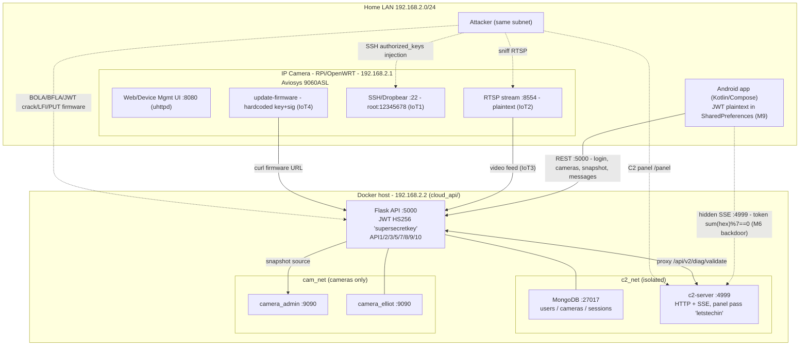

# Introduction: IP Camera Vulnerable Profile

This laboratory simulates a real-world security camera environment, including an enterprise-grade IP camera (simulated using OpenWRT on a Raspberry Pi), a backend API (running in a Docker container), and a mobile application. The goal is to provide a realistic scenario for analyzing and exploiting common vulnerabilities in video surveillance systems.

## Scenario

A video surveillance camera has been installed in your home, but the company is taking too long to configure your access to it. While you wait, you decide to investigate the security of your new camera and discover that it has several known vulnerabilities. You decide to take this opportunity to learn more about IoT device security and how to protect your home and others.

## Getting Started

To begin working with the IP Camera vulnerable profile, follow these steps:

### Hosts, ports and credentials

Where you call a service from decides which host to use. Keep this map at hand for the steps below.

| From | Target | URL or command | Login |
|------|--------|----------------|-------|
| Any host on the home LAN | Device management (OpenWRT, port 8080) | `http://192.168.2.1:8080` | `root` / `12345678` |
| Any host on the home LAN | Device SSH (dropbear, port 22) | `ssh root@192.168.2.1` | `root` / `12345678` |
| The PC running Docker | Cloud API | `http://localhost:5000` | app user `john` / `doe123` |
| An Android emulator on that PC | Cloud API | `http://10.0.2.2:5000` | `john` / `doe123` |
| A physical Android or another LAN host | Cloud API | `http://192.168.2.2:5000` | `john` / `doe123` |

The camera device is `192.168.2.1` and the Docker host (the PC running the containers) is `192.168.2.2` on the home LAN `192.168.2.0/24`. The Cloud API listens on port `5000` on the Docker host, so it is `localhost:5000` from that PC and `192.168.2.2:5000` from the rest of the LAN. `10.0.2.2` is the Android emulator's alias for the host loopback, so use it only from inside an emulator. The `root` / `12345678` device login is the weak default that IoT1 examines, and `john` / `doe123` is the app account that starts without camera access, simulating the onboarding wait.

1. **Deploy the Environment**

     Follow these steps to deploy the full vulnerable environment:

     **a) Start the IoT Device (OpenWRT Camera)**
     - Download and install the OpenWRT image on your device or a compatible virtual machine.
     - Connect the device to your local network and access the OpenWRT web interface at `http://192.168.2.1:8080`.
     - Log in with the device credentials `root` / `12345678` (see the access map above).
     - Configure the camera and required services as described in the `openwrt-resources/` folder.
     - Ensure the camera is accessible from your local network and the internal web interface is working.

     **b) Start the VulnZoo API (Backend) with Docker**
     - Open a terminal and navigate to the API folder:
         ```sh
         cd cloud_api/owlcam
         ```
     - Make sure Docker and Docker Compose are installed.
     - Launch the API services:
         ```sh
         docker-compose up -d --build
         ```
     - Wait for the containers to start. The API will be available at `http://localhost:5000` (or the port set in `docker-compose.yml`).
     - You can access the VulnZoo web interface to verify the API is running.
     - You must initiate the API data base by using the route http://localhost:5000/camerasdb/init. This will create the database and add the default camera for user `john`. This step is crucial for the mobile app to function correctly.
     If you encounter any issues with the database initialization, ensure that the API container has the necessary permissions to create and write to the database file. There is the route http://localhost:5000/camerasdb/reset that can be used to reset the database if needed.

     **c) Start the VulnZoo Mobile App**
     - You can use either:
         - An Android emulator (API 24 or higher, recommended: API 28+)
         - A physical Android device (API 24 or higher) with USB debugging enabled

     - To create and start an emulator from CLI (example for API 28):
         ```sh
         sdkmanager "system-images;android-28;google_apis;x86_64"
         avdmanager create avd -n test_avd -k "system-images;android-28;google_apis;x86_64" -d pixel
         emulator -avd test_avd
         ```

     - To build and install the APK:
         ```sh
         cd vulnzoo_apps/owlcam_app
         ./gradlew assembleDebug
         adb install -r app/build/outputs/apk/debug/app-debug.apk
         adb shell am start -n com.example.owlcamapp/.MainActivity
         ```

     - For emulators, use `10.0.2.2` as the API host (e.g., `http://10.0.2.2:5000`).
     - Log in or register from the app and test camera access and vulnerable features.

     **Notes:**
     - Ensure the Android device/emulator and the backend Docker are on the same network or that the emulator can reach the API.
     - See the `docs/` folder for more details on vulnerabilities and exploitation.
     - If you have connectivity issues, check firewalls, ports, and IP addresses.

2. **Access the System**
    
    - Open the web interface or the mobile application.
    - You can log in using the following test credentials:
        - **Username:** `john`
        - **Password:** `doe123`
    - This user has a camera registered but cannot access it until verified, simulating a typical onboarding process.
3. **Explore the Functionality**
    
    - As user `john`, navigate through the available features:
        - View the list of cameras.
        - Attempt to access the video stream.
        - Interact with the support system via `/messages`.
        - Explore the firmware update options and other administrative functionalities.
4. **Begin Your Security Assessment**
    
    - Start by identifying and exploiting vulnerabilities in the API, the device, and the ecosystem interfaces.
    - Review the documentation for detailed descriptions of each vulnerability and recommended attack paths.
    - You are encouraged to analyze authentication mechanisms, authorization controls, firmware update processes, and network communications.

## Using Docker for the API

To run the VulnZoo API backend using Docker, follow these steps:

1. Open a terminal and navigate to the API directory:
    ```sh
    cd cloud_api/owlcam
    ```

2. Make sure you have Docker installed on your system.
    - [Install Docker](https://docs.docker.com/get-docker/)

3. Build and start the API containers:
    ```sh
    docker compose up -d --build
    ```
    This command will build the images (if needed) and start the backend services defined in `docker-compose.yml`.

4. Wait for the containers to finish starting. The API will be available at:
    - `http://localhost:5000` (if running locally)
    - Or the port specified in your `docker-compose.yml` file

5. You can stop the API at any time with:
    ```sh
    docker compose down
    ```

You can also use `cloudctl.sh` script to manage the API:

![[owlcam_cloudctl.png]]

`cloudctl.sh` script shows some hints and includes a friendly URL on the PC so you can access the API web.

![[owlcam_cloudctl_init.png]]

**Note:**
- If you need to reset the database or persistent data, you may need to remove Docker volumes or use `docker-compose down -v`.
- Ensure that the API is running and accessible before using the web or mobile applications.
![[IPCamera_containers_API.png]]

## Recommendations

- Begin by logging in as `john` and familiarizing yourself with the user interface and available features. As `john`, you will have limited access. User `john` has a camera registered but cannot access it until verified its ownership, simulating a typical onboarding process. This will allow you to explore the vulnerabilities related to user verification and access control.
- Consult the vulnerability documentation for guidance on specific attack scenarios and technical details.
- Document your findings and consider both exploitation and mitigation strategies.

---

**Note:** This environment is intended for educational and research purposes only. Do not use these techniques on real systems without proper authorization.


